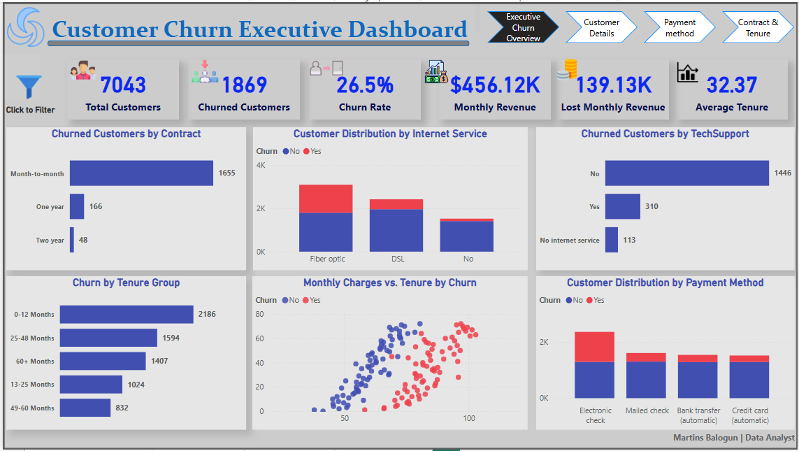
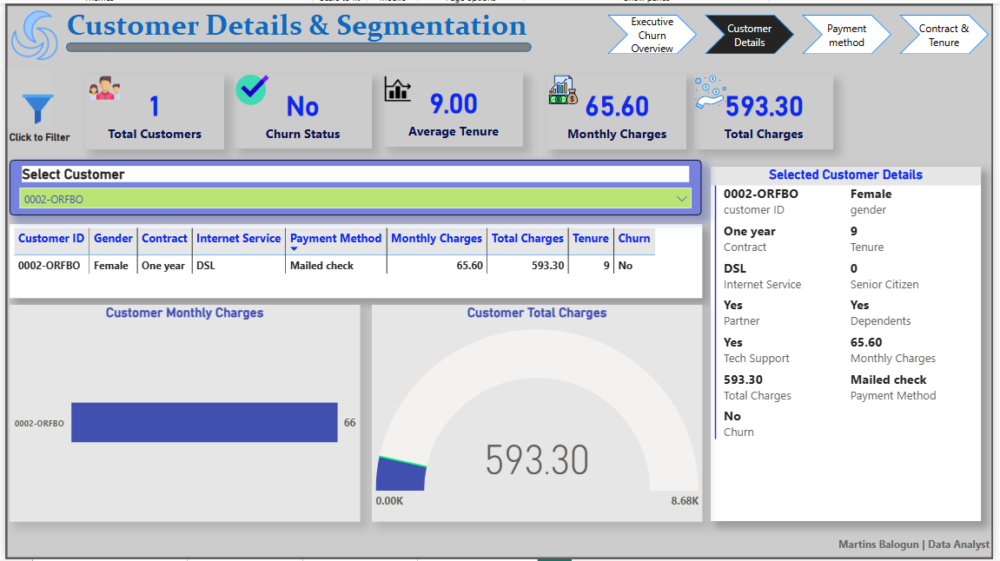
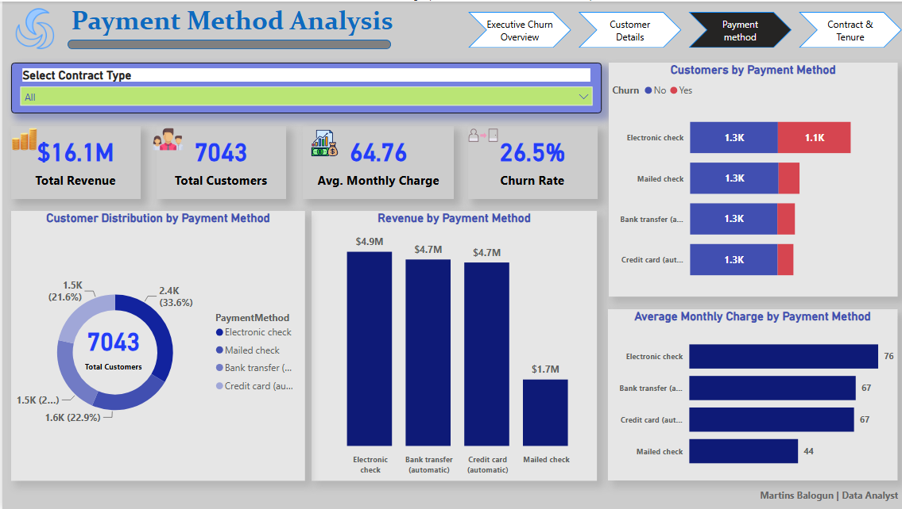
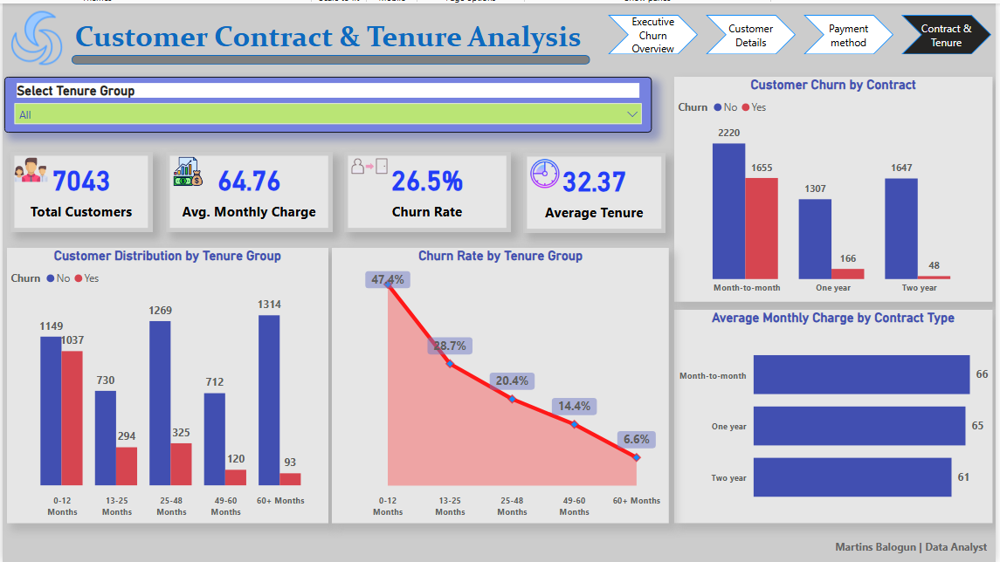

# 📊 Telco Customer Churn Analysis Dashboard (Power BI)

## 📌 Project Overview

This project analyzes customer churn in a telecommunications company using Microsoft Power BI. The dashboard provides interactive insights into customer behavior, churn trends, contract types, payment methods, and customer tenure.

The objective is to help business stakeholders identify customers at risk of churning and support data-driven decision-making to improve customer retention and revenue.

---

## 🎯 Business Objectives

This dashboard answers the following business questions:

- Which customers are more likely to churn?
- Which contract types have the highest churn rate?
- Which payment methods are associated with higher churn?
- How does customer tenure influence churn?
- Which customer segments require retention strategies?

---

## 📂 Dataset

This project uses the **IBM Telco Customer Churn Dataset**, a widely used dataset for customer retention and churn analysis.

### Dataset Summary

| Attribute | Value |
|----------|-------|
| Total Customers | 7,043 |
| Records | 7,043 |
| Features | 21 |
| Target Variable | Churn (Yes/No) |

### Key Fields

- Customer ID
- Gender
- Senior Citizen
- Partner
- Dependents
- Tenure
- Phone Service
- Internet Service
- Contract
- Payment Method
- Monthly Charges
- Total Charges
- Churn

---

## 🛠️ Tools & Technologies

- **Microsoft Power BI Desktop**
- **Power Query**
- **DAX (Data Analysis Expressions)**
- **Data Modeling**
- **Power BI Visualizations**
- **Git & GitHub**

---

## 📊 Dashboard Pages

This report consists of four interactive dashboard pages:

### 1️⃣ Executive Churn Overview

Provides an executive summary of customer churn and business performance.

**Key KPIs**
- Total Customers
- Churned Customers
- Churn Rate
- Monthly Revenue
- Total Revenue
- Average Monthly Charges

---

### 2️⃣ Customer Details & Segmentation

Allows users to explore individual customer information.

**Highlights**
- Customer search
- Customer profile
- Monthly Charges
- Total Charges
- Tenure
- Contract Type
- Payment Method
- Internet Service
- Churn Status

---

### 3️⃣ Payment Method Analysis

Analyzes customer payment behavior and its relationship with churn.

**Highlights**
- Revenue by Payment Method
- Customer Distribution
- Average Monthly Charges
- Churn by Payment Method

---

### 4️⃣ Contract & Tenure Analysis

Explores the impact of contract type and customer tenure on churn.

**Highlights**
- Churn by Contract
- Customer Distribution by Tenure
- Average Monthly Charges by Contract
- Churn Rate by Tenure Group

---
# 📷 Dashboard Preview

## Executive Churn Overview



---

## Customer Details & Segmentation



---

## Payment Method Analysis



---

## Contract & Tenure Analysis



---


# 📈 Key Insights

After analyzing the customer churn data, the following insights were discovered:

### 📌 Executive Overview
- The dataset contains **7,043 customers**.
- The overall churn rate is approximately **26.5%**.
- Total revenue generated from customers exceeds **$16 million**.
- Customers with lower tenure contribute disproportionately to churn.

### 📌 Customer Details & Segmentation
- Customer profiles allow quick investigation of churned and retained customers.
- Customers on month-to-month contracts are more likely to churn.
- Customers with higher tenure generally have higher total charges and stronger retention.

### 📌 Payment Method Analysis
- Customers using **Electronic Check** have the highest churn.
- Customers using **Bank Transfer (Automatic)** and **Credit Card (Automatic)** have lower churn rates.
- Automatic payment methods are associated with better customer retention.

### 📌 Contract & Tenure Analysis
- Month-to-month contracts experience the highest customer churn.
- Two-year contracts have the lowest churn.
- Customers within their first year are at the greatest risk of leaving.
- Churn decreases as customer tenure increases.

---

# 💼 Business Recommendations

Based on the analysis, the following recommendations can help improve customer retention:

- Encourage customers to migrate from month-to-month contracts to one- or two-year contracts.
- Promote automatic payment methods through discounts or incentives.
- Develop targeted retention campaigns for customers in their first 12 months.
- Introduce loyalty programs for long-tenure customers.
- Monitor high-risk customer segments and intervene before churn occurs.

---

# 🧠 Skills Demonstrated

This project demonstrates the following technical and analytical skills:

- Data Cleaning with Power Query
- Data Modeling in Power BI
- DAX Measure Development
- Interactive Dashboard Design
- KPI Development
- Customer Segmentation
- Business Intelligence Reporting
- Data Storytelling
- Dashboard Navigation
- Bookmarks and Buttons
- Slicers and Filters
- Business Insight Generation


---

# 📁 Repository Structure

```text
Telco-Churn-Analysis-PowerBI/
│
├── 📄 README.md
├── 📄 LICENSE
├── 📄 .gitignore
├── 📊 Telco Customer Churn Analysis.pbix
│
├── 📁 dataset/
│   └── Telco-Customer-Churn.csv
│
├── 📁 images/
│   ├── executive-overview.png
│   ├── customer-details.png
│   ├── payment-method-analysis.png
│   └── contract-tenure-analysis.png
│
└── 📁 dax/
    └── DAX-Measures.md
```

---

# 🚀 Future Improvements

Potential enhancements include:

- Predict customer churn using Machine Learning.
- Publish the report to Power BI Service.
- Enable Row-Level Security (RLS).
- Add drill-through pages for customer-level exploration.
- Build a mobile-optimized report layout.
- Automate dataset refresh.

---

# 👨‍💻 Author

**Martins F. Balogun**

**Statistician | Data Analyst | Business Intelligence Developer**

Passionate about transforming raw data into actionable business insights using Power BI, SQL, Python, and statistical analysis.

### Connect with me

- 💼 LinkedIn: *https://www.linkedin.com/in/mfbalogun*
- 💻 GitHub: *https://github.com/bmartech*
- 📧 Email: *martinsfriday.mf@gmail.com*
